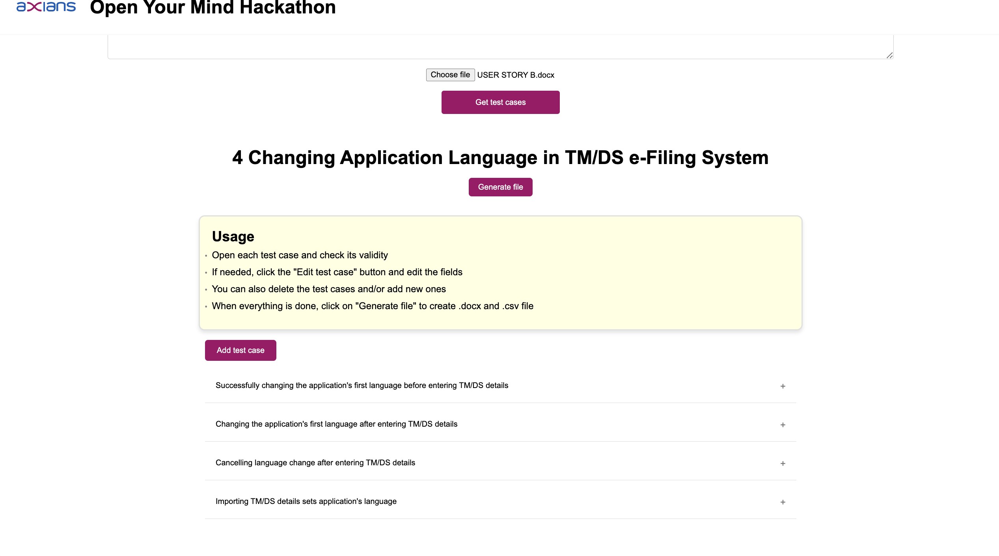
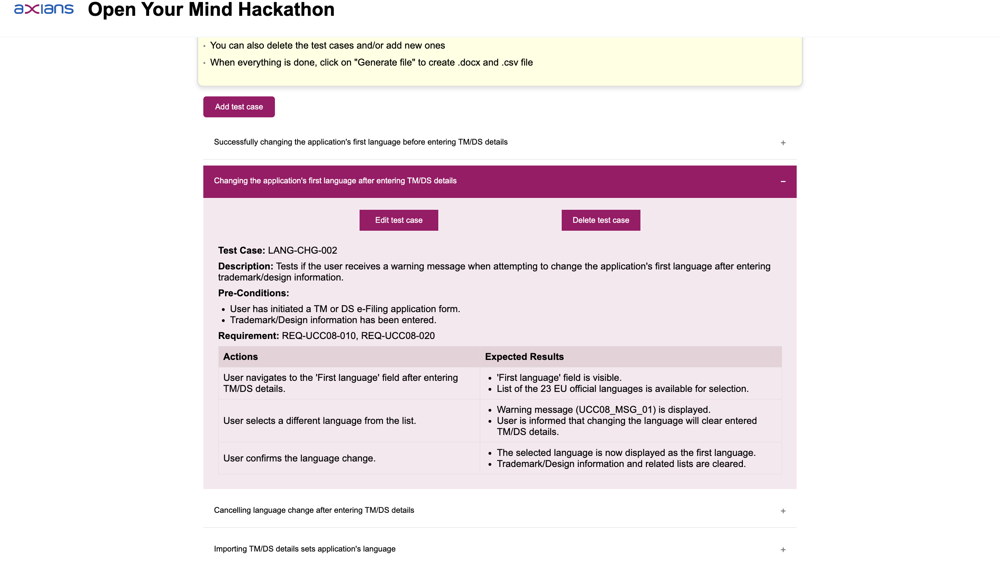

# Automated Test Case Generation using Generative AI

## Overview
This project aims to automate the creation of test cases from user story files utilizing generative AI, specifically leveraging OpenAI's ChatGPT-4 model. The purpose is to streamline the testing process by generating comprehensive test cases directly from user stories, reducing manual effort and improving efficiency.

## Features
- **Automated Test Case Generation**: Utilizes generative AI to automatically generate test cases from user story files.
- **OpenAI's ChatGPT-4 Model**: Employs the latest version of OpenAI's powerful language model for natural language understanding and generation.
- **Customizable Templates**: Allows customization of test case templates and generated files to fit specific project requirements.
- **Efficiency and Accuracy**: Enhances testing efficiency by rapidly generating test cases while ensuring accuracy and coverage.

## Installation
To run the project, follow the following steps:

1. Clone the repository:
    ```bash
    git clone https://github.com/ratavare/Axians-Hackathon.git
    ```

2. Install dependencies:    
	*Make sure you have an up-to-date version of*:    
	-	[Python3](python.org/downloads)
	-	[Node.js](nodejs.org)

3. Guarantee that a valid API key is stored in the backend/key.py file in the format
   ```bash
   api_key1 = <API_KEY>
   ```

## Run the code
1. Prepare User Story Files:
    - Ensure user stories are written in a standardized format, according to Axians guidelines.
    - Ensure files are .docx files.

2. Run the Script:    
	- Open a terminal window and go to the repository directory.
	```bash
	cd <path-to-repository-folder>
	```    
	- Run the installation script.    
	```bash
	bash run.sh
	```
 3. Open your web browser and go to: [http://localhost:5173/](http://localhost:5173/)


## Usage
 

- **Use the "Choose File/Browse" button to browse through your file explorer and choose the User Story file to be uploaded.**
- **Press the "Get test cases" button to start the User Test Case file generation, please wait patiently ❤️.**

  

#### Once the test case files are generated you'll be able to:
- **Open each test case and check its content**
- **Click the “Edit test case” button and edit the fields**
- **Delete or add any test cases**
- **Click on the "Generate file" button to create .csv and .docx files**
- **Download those files**
- **Clear the generated test cases**

## Contributors
- **[ratavare](github.com/ratavare)**
- **[tmanso9](github.com/tmanso9)**
- **[abaiao-r](github.com/abaiao-r)**
- **[turman17](github.com/turman17)**

*BYE! HAVE A BEAUTIFUL TIME!*    
 
